# Benchmarking pyturboquant

*A companion piece to [Understanding TurboQuant](README.md)*

To ground the theory in practice, we built `pyturboquant` — an experimental Python vector index that implements TurboQuant's core algorithm: random orthogonal rotation followed by Lloyd-Max 4-bit quantization. This document records the full results of our benchmarking sessions across four progressively demanding experiments.

**Embedding model:** `all-MiniLM-L6-v2` (384 dimensions)
**Quantization:** 4-bit, TurboQuant Algorithm 1 & 2
**Data source:** *The Adventures of Sherlock Holmes* (128,458 lines of text)

### Test Environments

| | CPU | GPU |
|---|---|---|
| **Hardware** | Intel CPU (MKL-optimized) | NVIDIA GeForce RTX 5060 Laptop GPU (8 GB VRAM) |
| **PyTorch** | 2.11.0 | 2.12.0.dev (CUDA 12.8) |
| **OS** | Windows | Windows |

---

## What We Were Testing

We wanted to answer four questions that matter in practice:

1. **Compression quality** — How much geometric information is lost when a vector is quantized to 4 bits?
2. **Semantic preservation** — Can the compressed index still find the correct answer to a natural language query?
3. **Memory savings** — How much smaller is the compressed index vs. full-precision storage?
4. **Search speed trade-off** — At what scale does the memory advantage start to offset the decompression cost?

---

## Experiment 1: Single Vector Round-Trip

The first test is the simplest possible sanity check: take one random 128-dimensional vector, compress it to 4 bits, decompress it, and measure how much was lost.

The quantizer normalises the vector, applies a seeded random rotation matrix, bins each coordinate against Lloyd-Max boundaries via binary search, and packs the resulting indices into 4-bit representation. Decompression reverses the process: unpack the indices, look up the codebook centroids, apply the inverse rotation, and rescale by the saved norm.

### Raw Output

```
--- Original Vector (First 5 components) ---
tensor([ 0.2744, -1.2023, -0.9818,  0.0014,  0.5050])

--- Compressed Representation ---
Original size (fp32): 512 bytes
Compressed size:      64 bytes + 4 bytes norm
Compression Ratio:    7.53x

--- Reconstructed Vector (First 5 components) ---
tensor([ 0.2388, -1.2592, -1.1447, -0.1163,  0.4588])

--- Accuracy ---
Mean Squared Error: 0.01007115
Cosine Similarity:  0.9952 (1.0 is perfect)
```

### Results

| Metric | Value |
|---|---|
| Original size | 512 bytes |
| Compressed size | 68 bytes (64 + 4 norm) |
| **Compression ratio** | **7.53x** |
| MSE | 0.0101 |
| **Cosine Similarity** | **0.9952** |

> A cosine similarity of 0.9952 means the reconstructed vector points in virtually the same direction as the original. The quantization "loss" is negligible for downstream tasks like similarity search.


---

## Experiment 2: Small-Scale Semantic Search (10 Sentences)

The second test asks: does the compressed index still find the *semantically correct* answer, even after discarding 87% of the data?

We encoded 10 real English sentences into 384-dimensional vectors using `all-MiniLM-L6-v2`. We then ran the same query against two indices: a standard FP32 tensor searched via matrix multiplication, and a `TurboQuantIndex` searched via its compressed dot product.

**Query:** *"Someone is playing a musical instrument"*

### Raw Output

```
METRIC               | OLD WAY (FP32)     | NEW WAY (TQ)
------------------------------------------------------------
Memory Usage         |     15,360 bytes   |    2,000 bytes
Storage Savings      | 1.00x (Baseline)   |     7.68x SAVINGS
------------------------------------------------------------
Indexing Time        |          0.01 ms   |      28.83 ms
Search Time          |        0.8216 ms   |     0.5497 ms
------------------------------------------------------------
Top Result           | A woman is playing violin... | A woman is playing violin...
------------------------------------------------------------

SUCCESS: Both systems found the same correct answer despite the 8x compression!
```

### Results

| Metric | Old Way (FP32) | TurboQuant (4-bit) |
|---|---|---|
| Memory | 15,360 bytes | **2,000 bytes** |
| Compression | 1.00x | **7.68x** |
| Search time | 0.82 ms | 0.55 ms |
| Top result | ✅ A woman is playing violin | ✅ A woman is playing violin |

> [!IMPORTANT]
> Both systems returned the identical correct answer. The query *"musical instrument"* does not appear in any sentence — the system inferred that a **violin** is a musical instrument purely from the vector geometry, even after 8x compression.

---

## Experiment 3: Large-Scale Text Retrieval (2,000 Paragraphs)

The third test scales up to 2,000 real paragraphs from *The Adventures of Sherlock Holmes* and introduces five diverse semantic queries. The goal is to measure retrieval accuracy under conditions closer to a real RAG pipeline.

All 2,000 paragraphs were encoded with `all-MiniLM-L6-v2` (taking 6.97 s). Both a FP32 tensor and a `TurboQuantIndex` were built from the same embeddings, and each query was run against both.

### Queries Used
1. *"Who is Sherlock Holmes's companion?"*
2. *"What is Holmes's address in London?"*
3. *"What instrument does Sherlock Holmes play?"*
4. *"A story about a secret organization or club"*
5. *"How does Sherlock Holmes solve crimes?"*

### Raw Output

```
METRIC                    | OLD WAY (FP32)  | NEW WAY (TQ)
------------------------------------------------------------
Total Memory              |       3000.0 KB |        390.6 KB
Compression Ratio         |           1.00x |           7.68x
Avg Search Time           |       0.1375 ms |       5.2816 ms
Retrieval Match Rate      |            100% |           80.0%
============================================================

Example Query: 'What instrument does Sherlock Holmes play?'
Found: 'I had seen little of Holmes lately. My marriage had drifted
us away from each other. My own complete...'
```

### Results

| Metric | Old Way (FP32) | TurboQuant (4-bit) |
|---|---|---|
| Memory | 3,000 KB | **390.6 KB** |
| Compression | 1.00x | **7.68x** |
| Avg search time | **0.14 ms** | 5.28 ms |
| **Retrieval match rate** | 100% | **80.0%** |

> [!WARNING]
> The 80% match rate means that for 1 out of 5 queries, TurboQuant returned a **different** (but likely still relevant) paragraph than the full-precision search. This is the inherent trade-off of lossy compression. Increasing to `bits=8` would improve accuracy at the cost of 2x more storage.

---

## Experiment 4: Multi-Scale Stress Test (100K – 1M Vectors)

The final test is the most demanding: scale the database from 100,000 to 1,000,000 vectors and measure how both memory footprint and search speed evolve, on CPU and then on GPU.

We encoded the 2,000 Sherlock Holmes paragraphs, then tiled and perturbed them with Gaussian noise to reach each target count. To avoid GPU out-of-memory errors during bit-packing, vectors were added to the index in batches of 50,000. Search accuracy was measured using 50 queries — 25 hand-crafted semantic queries and 25 sampled directly from the text — with recall measured by original paragraph identity to avoid false negatives from near-duplicate vectors.

### 4a. CPU Baseline (100K Vectors)

| Metric | Old Way (FP32) | TurboQuant (4-bit) |
|---|---|---|
| Memory | 146.48 MB | **19.07 MB** |
| Compression | 1.00x | **7.7x** |
| Search time | **3.82 ms** | 414.58 ms |

> [!NOTE]
> On CPU at 100K vectors, brute-force matrix multiplication is ~108x faster. TurboQuant's decompression overhead — unpack → centroid lookup → inverse rotation — dominates at this scale. The value here is entirely in the memory saving.

### 4b. GPU Multi-Scale Results (RTX 5060, 8 GB VRAM)

```
===============================================================================================
 FINAL RESULTS (50 queries, recall by original paragraph)
===============================================================================================
   Vectors |    Old Mem |     TQ Mem |  Ratio |  Old Search |   TQ Search |    R@1 |   R@10 | Status
-----------------------------------------------------------------------------------------------
   100,000 |    146.5MB |     19.1MB |   7.7x |      1.07ms |     41.58ms |  92.0% |  97.5% | OK
   300,000 |    439.5MB |     57.2MB |   7.7x |     28.05ms |    135.18ms |  90.0% |  98.3% | OK
   500,000 |    732.4MB |     95.4MB |   7.7x |     47.20ms |    228.29ms |  88.0% |  99.5% | OK
 1,000,000 |   1464.8MB |    190.7MB |   7.7x |     97.09ms |    497.12ms |  90.0% |  98.7% | OK
===============================================================================================
```

| Scale | Old Memory | TQ Memory | Compression | Old Search | TQ Search | Speed Gap | R@1 | R@10 |
|---|---|---|---|---|---|---|---|---|
| 100K | 146.5 MB | **19.1 MB** | **7.7x** | **1.07 ms** | 41.58 ms | 39x | **92%** | **97.5%** |
| 300K | 439.5 MB | **57.2 MB** | **7.7x** | **28.05 ms** | 135.18 ms | **4.8x** | **90%** | **98.3%** |
| 500K | 732.4 MB | **95.4 MB** | **7.7x** | **47.20 ms** | 228.29 ms | **4.8x** | **88%** | **99.5%** |
| 1M | 1,464.8 MB | **190.7 MB** | **7.7x** | **97.09 ms** | 497.12 ms | **5.1x** | **90%** | **98.7%** |

> [!IMPORTANT]
> **Recall is remarkably stable across all scales.** Recall@1 remains ~90% and Recall@10 stays ~98% whether the database has 100K or 1M vectors. The quantization accuracy is a fixed property of the algorithm's codebook, not the database size.

> [!NOTE]
> **The speed gap narrows dramatically with scale.** At 100K vectors, brute-force is 39x faster. At 300K+, the gap collapses to ~5x because FP32 `matmul` becomes **memory-bandwidth bound** — the GPU is now streaming 1.4 GB of data per query vs. TurboQuant's 190 MB.

### 4c. Scaling Trend: Search Time vs. Vector Count (GPU)

```mermaid
xychart-beta
    title "Search Time vs. Scale (GPU)"
    x-axis ["100K", "300K", "500K", "1M"]
    y-axis "Search Time (ms)" 0 --> 500
    bar [1.07, 28.05, 47.20, 97.09]
    bar [41.58, 135.18, 228.29, 497.12]
```



Both methods scale **linearly** with vector count — both are brute-force O(n) scans. At 1M vectors:

- FP32 requires **1.46 GB** of VRAM just for the index
- TurboQuant requires only **190 MB** of VRAM for the same index
- At 10M vectors, FP32 would need **~14.6 GB** (exceeding most GPUs), while TurboQuant would need only **~1.9 GB**

---

## Summary & Conclusions

### The Headline Numbers

Across all experiments — from 10 sentences to 1,000,000 vectors, on both CPU and GPU — TurboQuant consistently delivered **7.7x compression** at 4-bit quantization with **~90% Recall@1** and **~98% Recall@10**, measured across 50 diverse queries.

### The Full Trade-off Picture

| Scale | Device | Compression | Speed Gap | Recall@1 | Recall@10 |
|---|---|---|---|---|---|
| 10 vectors | CPU | 7.68x | Tie | 100% | — |
| 2,000 vectors | CPU | 7.68x | FP32 ~38x faster | 80% | — |
| 100,000 vectors | CPU | 7.7x | FP32 ~108x faster | — | — |
| 100,000 vectors | GPU | 7.7x | FP32 ~39x faster | **92%** | **97.5%** |
| 300,000 vectors | GPU | 7.7x | FP32 **~5x faster** | **90%** | **98.3%** |
| 500,000 vectors | GPU | 7.7x | FP32 **~5x faster** | **88%** | **99.5%** |
| 1,000,000 vectors | GPU | 7.7x | FP32 **~5x faster** | **90%** | **98.7%** |
| **10M+ vectors** | Any | 7.7x | **TurboQuant (only option)** | **~90%** | **~98%** |

### Key Takeaways

1. **TurboQuant is primarily a memory optimization** at its current stage. Its practical value is enabling vector search at scales where full-precision storage would exceed available RAM or VRAM.

2. **Accuracy is excellent and scale-independent.** Recall@1 stays at ~90% and Recall@10 at ~98% from 100K to 1M vectors. The quantization error is a fixed property of the Lloyd-Max codebook, not the database size.

3. **Semantic meaning survives extreme compression.** A query for "musical instrument" correctly found "violin" even after discarding 87% of the data. Random rotation makes the coordinate distribution Gaussian, and Lloyd-Max codebooks are specifically optimised to preserve that structure.

4. **The speed gap narrows as scale increases.** On GPU, the FP32 advantage drops from ~39x at 100K to ~5x at 300K+. Brute-force `matmul` becomes memory-bandwidth bound at scale — TurboQuant's smaller data footprint partially offsets its decompression cost.

5. **At 10M+ vectors, TurboQuant becomes the only viable option.** FP32 storage requires ~14.6 GB — exceeding most GPU VRAM budgets — while TurboQuant needs only ~1.9 GB.

6. **The remaining speed gap is an architectural problem, not an algorithmic one.** An Inverted File Index (IVF) partition layer would eliminate the brute-force O(n) scan, reducing each query to decompressing ~1% of the database. This is the natural next step for `pyturboquant`.
