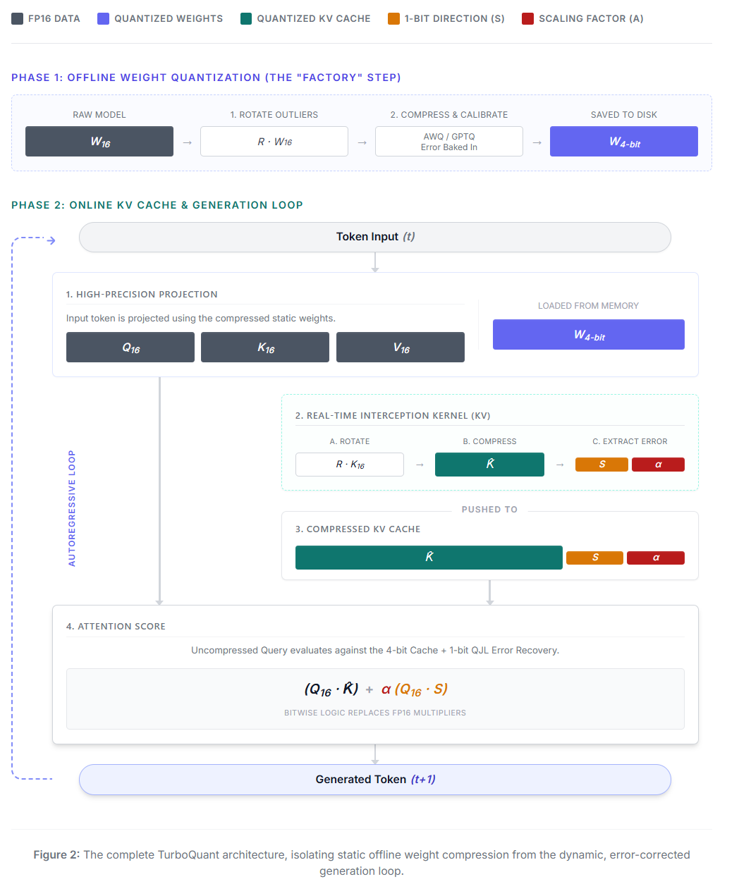

# Deep Dive: Quantized Johnson-Lindenstrauss (QJL)

*A supplementary guide for [Understanding TurboQuant](README.md)*

Even with random rotation smoothing out outliers, compressing a 16-bit floating point number to just 3 or 4 bits intrinsically causes some loss of precision. Over thousands of tokens, these tiny rounding errors can compound and bias the attention mechanism. 

To fix this, TurboQuant employs a real-time, ultra-lightweight error correction scheme based on the **Johnson-Lindenstrauss** lemma.

## The Residual Error

When we quantize a high-precision vector $V_{16}$ into a low-bit vector $\hat{V}_q$, we generate a specific, mathematically measurable error for every single dimension. We call this the Residual Error ($E$):
$$E = V_{16} - \hat{V}_q$$

In a perfect world, we would store $E$ alongside the quantized vector and simply add it back during decompression. However, storing $E$ requires full FP16 precision, completely defeating the purpose of our 4-bit compression. We need a way to store the *essence* of the error using almost zero memory.

## 1-Bit Error Direction ($S$)

Instead of storing exactly *how much* the quantization missed by, what if we only store *which direction* it missed?

The algorithm extracts the sign of the error for every dimension:
$$S_i = \text{sgn}(E_i)$$
* If the quantized value was smaller than the true value, $S_i = +1$.
* If the quantized value was larger than the true value, $S_i = -1$.

Since this is purely binary data, we can pack 8 dimension signs into a single byte. For a 128-dimensional vector, the entire "Sign Matrix" takes up a microscopic 16 bytes.

## The Scaling Factor ($\alpha$)

To make these $+1$ and $-1$ directions useful, we calculate a single average magnitude for the error across the entire vector (or block of dimensions):
$$\alpha = \frac{1}{d} \sum_{i=1}^{d} |E_i|$$

This $\alpha$ is stored in full FP16 precision. Because there is only one $\alpha$ scalar per vector block, its memory overhead is negligible.

We have now successfully approximated the massive FP16 error tensor as:
$$E \approx \alpha S$$

## Hardware-Accelerated Correction

During the attention calculation, the Query vector ($Q$) must take the dot product against the corrected Key vector ($K \approx \hat{K} + \alpha S$).

By distributing the dot product, we get:
$$Q \cdot K \approx (Q \cdot \hat{K}) + \alpha(Q \cdot S)$$

The genius of this approach lies in how hardware executes $\alpha(Q \cdot S)$.
Because $S$ only contains $+1$ and $-1$, computing $Q \cdot S$ **requires no multiplication**. The CUDA kernel simply iterates over the Query dimensions and performs bitwise addition or subtraction based on the packed bits in $S$. 

This bitwise logic executes at blistering speed on modern GPUs. We get the accuracy recovery of an FP16 error-correction pass, executed using the latency profile of an integer addition.

